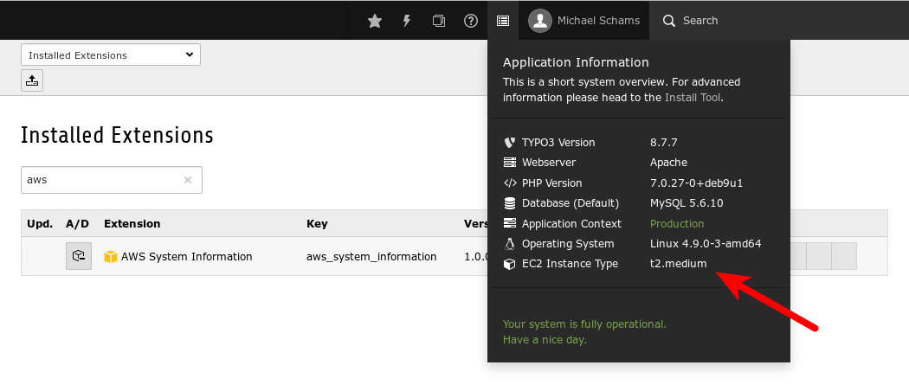

.. =============================================================================
.. AWS System Information
.. (c)2018 Michael Schams <schams.net>
.. https://schams.net
.. =============================================================================

.. include:: ../Includes.txt

General Information
-------------------

Introduction
^^^^^^^^^^^^

`Amazon Web Services <https://aws.amazon.com>`_ (AWS) provide high-end cloud computing services. One of their services is *Amazon Elastic Compute Cloud* (Amazon EC2), which is a web service that provides secure, resizable compute capacity in the cloud. A machine image running on EC2 can build a high performance virtual server, which can host one or multiple TYPO3 instances. These machine images can be launched using a specific instance type, which basically vary in server specs (e.g. memory, CPU units, etc.).

This extension enables TYPO3 administrators to easily lookup which instance type is currently used for the the underlying EC2 instance.

.. _system-requirements:

Requirements
^^^^^^^^^^^^

* TYPO3 v8 LTS (TYPO3 version 8.7.x)
* PHP version 7.0 or higher

The installation of the extension requires administrator privileges in TYPO3 or appropriate access in the command line, if installed via `PHP composer <https://getcomposer.org/>`_.
